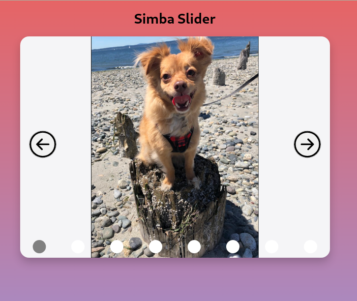
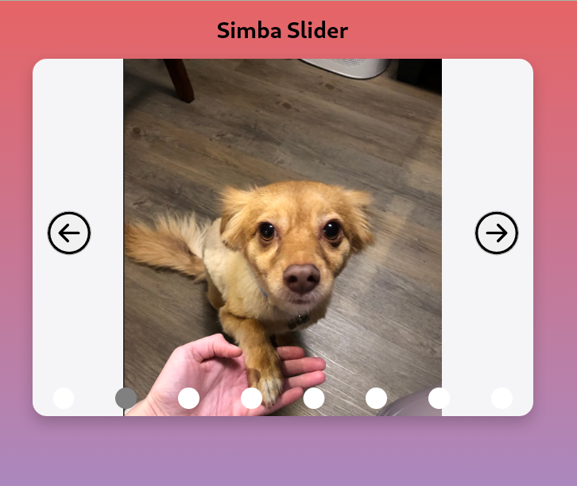
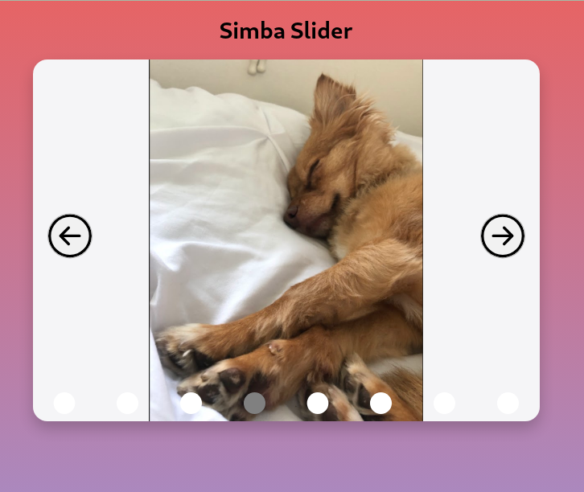

# React Practice: Simba Slider

This app for junior developers or those learning React.js. Use specs.txt, [demo](https://www.youtube.com/watch?v=Ml1HxBFIO0Y&list=PLvY9geuvFZ5eLt3ydDieayked877ykmbi&ab_channel=Peyton), and the completed solution sample images as a guide. All styling assets such as images and icons have been provided for you.

## Demos and Visuals

[Link to Simba Slider demo video](https://www.youtube.com/watch?v=Ml1HxBFIO0Y&list=PLvY9geuvFZ5eLt3ydDieayked877ykmbi&ab_channel=Peyton)







## Learning Goals and Concepts

1. React's useState hook and state management
2. Using JavaScript .map() array method to map over a collection
3. Working with [react-icons](https://react-icons.github.io/react-icons) library

## Installation

Fork and clone this repository, then run

```bash
cd challenge # cd into the challenge directory to start solving
npm install # install dependencies
npm start # runs the app in dev mode
```

### Resources

This project was inspired by the article, [10 React JS Practice Exercises with solution](https://contactmentor.com/react-js-practice-exercises-solution/?expand_article=1) and references the [image slider](https://www.youtube.com/watch?v=og3wCO98HkQ&t=85s&ab_channel=TheWebSchool.) created by [The Web School.](https://www.youtube.com/@TheWebSchool)
